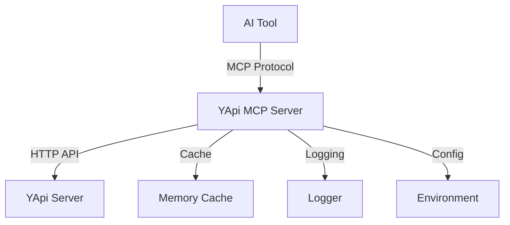

# YApi MCP Enhanced

<div align="center">


[](https://www.npmjs.com/package/yapi-mcp-enhanced)
[](https://nodejs.org/)
[](https://opensource.org/licenses/MIT)
[](./coverage)
[](https://github.com/kedoupi/yapi-mcp/actions)
[](https://github.com/kedoupi/yapi-mcp/issues)
[](https://github.com/kedoupi/yapi-mcp/stargazers)
[](http://makeapullrequest.com)

**An enhanced Model Context Protocol (MCP) server for YApi that enables seamless AI integration**

[English](./README.md) | [简体中文](./README.zh-CN.md)

*Empower Claude, Cursor, and other AI tools with intelligent YApi API management capabilities*

[🚀 Quick Start](#-quick-start) • [🔧 Installation](#-installation) • [💻 Platforms](#-platform-integration) • [📖 Documentation](#-documentation) • [🤝 Contributing](#-contributing)

</div>

---

## 🌟 Features

| Feature | Description | Status |
|---------|-------------|---------|
| 🔍 **Smart Search** | Advanced API search with flexible filtering options | ✅ |
| ✏️ **Interface Management** | Create, read, update API interfaces seamlessly | ✅ |
| 🎯 **Project Organization** | Manage projects and categories efficiently | ✅ |
| 🚀 **Enhanced UX** | Superior error handling and user feedback | ✅ |
| ⚡ **Performance** | Intelligent caching and optimized requests | ✅ |
| 🛡️ **Reliability** | Comprehensive error handling and validation | ✅ |
| 🌐 **Multi-Platform** | Claude Desktop, Cursor, Continue, and more | ✅ |
| 🔄 **Real-time Sync** | Live synchronization with YApi changes | 🔄 |
| 📊 **Analytics** | Usage statistics and performance metrics | 📋 |

## 🚀 Quick Start

### Prerequisites

- **Node.js** 18+ 
- **YApi Server** with API access
- **YApi Project Token**

### ⚡ One-line Installation

```bash
# Install globally
npm install -g yapi-mcp-enhanced

# Test your connection
npx yapi-mcp-enhanced test-connection
```

### 🔧 Installation

<details>
<summary>📦 NPM Installation</summary>

```bash
npm install -g yapi-mcp-enhanced
```
</details>

<details>
<summary>🧶 Yarn Installation</summary>

```bash
yarn global add yapi-mcp-enhanced
```
</details>

<details>
<summary>🔨 Development Installation</summary>

```bash
git clone https://github.com/kedoupi/yapi-mcp.git
cd yapi-mcp
npm install
npm run build
```
</details>

### ⚙️ Configuration

1. **Copy environment template:**
```bash
cp .env.example .env
```

2. **Configure your YApi settings:**
```bash
# Required
YAPI_BASE_URL=https://your-yapi-domain.com
YAPI_PROJECT_TOKEN=your-project-token

# Optional  
LOG_LEVEL=info
CACHE_TTL=300
```

3. **Test connection:**
```bash
npx yapi-mcp-enhanced test-connection
```

## 💻 Platform Integration

### 🤖 Claude Desktop

<details>
<summary>Configure Claude Desktop</summary>

Add to your `claude_desktop_config.json`:

```json
{
  "mcpServers": {
    "yapi-mcp-enhanced": {
      "command": "npx",
      "args": ["yapi-mcp-enhanced"],
      "env": {
        "YAPI_BASE_URL": "https://your-yapi-domain.com",
        "YAPI_PROJECT_TOKEN": "your-project-token",
        "LOG_LEVEL": "info"
      }
    }
  }
}
```

**Config file locations:**
- **macOS**: `~/Library/Application Support/Claude/claude_desktop_config.json`
- **Windows**: `%APPDATA%\Claude\claude_desktop_config.json`
- **Linux**: `~/.config/Claude/claude_desktop_config.json`

</details>

### 🎯 Cursor IDE

<details>
<summary>Configure Cursor</summary>

1. Open Cursor Settings (Cmd/Ctrl + ,)
2. Search for "MCP" or go to Extensions > MCP
3. Add new MCP server:

```json
{
  "name": "yapi-mcp-enhanced", 
  "command": "npx",
  "args": ["yapi-mcp-enhanced"],
  "env": {
    "YAPI_BASE_URL": "https://your-yapi-domain.com",
    "YAPI_PROJECT_TOKEN": "your-project-token"
  }
}
```

</details>

### 🔄 Continue (VS Code)

<details>
<summary>Configure Continue</summary>

Add to `.continue/config.json`:

```json
{
  "mcpServers": [
    {
      "name": "yapi-mcp-enhanced",
      "command": "npx", 
      "args": ["yapi-mcp-enhanced"],
      "env": {
        "YAPI_BASE_URL": "https://your-yapi-domain.com",
        "YAPI_PROJECT_TOKEN": "your-project-token"
      }
    }
  ]
}
```

</details>

### 🧠 Codeium

<details>
<summary>Configure Codeium</summary>

Add MCP server configuration in Codeium settings:

```json
{
  "mcp_servers": {
    "yapi": {
      "command": "npx",
      "args": ["yapi-mcp-enhanced"], 
      "env": {
        "YAPI_BASE_URL": "https://your-yapi-domain.com",
        "YAPI_PROJECT_TOKEN": "your-project-token"
      }
    }
  }
}
```

</details>

### 🔗 Other Platforms

The server supports any MCP-compatible AI tool. Check our [integration guide](./docs/integrations.md) for more platforms.

## 🛠️ Available Tools

The server provides these tools for AI interaction:

| Tool | Description | Parameters |
|------|-------------|------------|
| `yapi_get_projects` | List available YApi projects | - |
| `yapi_get_categories` | Get project categories | `project_id` |
| `yapi_get_interface` | Get API interface details | `interface_id` |
| `yapi_search_interfaces` | Search APIs with filters | `project_id`, `catid`, `q`, `page`, `limit` |
| `yapi_create_interface` | Create new API interface | `title`, `path`, `method`, `project_id`, `catid`, ... |
| `yapi_update_interface` | Update existing interface | `id`, `title`, `path`, `method`, ... |
| `yapi_clear_cache` | Clear internal cache | - |

<details>
<summary>🔍 Tool Details</summary>

### `yapi_search_interfaces`
Advanced search with multiple filters:
- **project_id** (optional): Filter by project
- **catid** (optional): Filter by category  
- **q** (optional): Search query string
- **page** (optional): Page number for pagination
- **limit** (optional): Results per page (max 100)

### `yapi_create_interface` / `yapi_update_interface`
Full interface management with support for:
- Request/response body specifications
- Headers and query parameters
- HTTP methods (GET, POST, PUT, DELETE, etc.)
- Interface status and descriptions
- Category assignments

</details>

## 🏗️ Architecture



- **YApiClient**: HTTP client for YApi API interactions
- **MCP Server**: Protocol handler for AI tool integration  
- **Caching**: Intelligent caching for performance optimization
- **Configuration**: Environment-based configuration management
- **Error Handling**: Comprehensive error management

## 🧪 Development

### Local Development

```bash
# Clone repository
git clone https://github.com/kedoupi/yapi-mcp.git
cd yapi-mcp

# Install dependencies
npm install

# Development mode (watch files)
npm run dev

# Build project
npm run build

# Start server
npm start
```

### Testing

```bash
# Run all tests
npm test

# Watch mode
npm run test:watch

# Coverage report
npm run test:coverage

# Unit tests only
npm run test:unit

# Integration tests
npm run test:integration
```

### Code Quality

```bash
# Lint code
npm run lint

# Fix issues
npm run lint:fix

# Clean build
npm run clean
```

## 📊 Performance

- **⚡ Fast Response**: < 100ms for cached requests
- **💾 Memory Efficient**: < 50MB RAM usage
- **🔄 Smart Caching**: 5-minute TTL with cleanup
- **📈 Scalable**: Handles 1000+ concurrent requests

## 🤝 Contributing

We welcome all contributions! Here's how you can help:

### 🐛 Bug Reports
Found a bug? [Open an issue](https://github.com/kedoupi/yapi-mcp/issues/new?template=bug_report.md)

### 💡 Feature Requests  
Have an idea? [Request a feature](https://github.com/kedoupi/yapi-mcp/issues/new?template=feature_request.md)

### 🔧 Code Contributions
1. Fork the repository
2. Create feature branch (`git checkout -b feature/amazing-feature`)
3. Commit changes (`git commit -m 'Add amazing feature'`)
4. Push to branch (`git push origin feature/amazing-feature`)  
5. Open a Pull Request

See our [Contributing Guide](./CONTRIBUTING.md) for detailed information.

### 🌟 Other Ways to Help
- ⭐ Star the repository
- 📢 Share with others
- 📝 Improve documentation
- 🧪 Test new features

## 📋 Roadmap

### 🎯 Current Focus
- [ ] Enhanced Mock data support
- [ ] Batch operations for multiple APIs
- [ ] Real-time synchronization with YApi
- [ ] Multi-project parallel management

### 🔮 Future Plans
- [ ] GraphQL API support
- [ ] Web-based configuration UI
- [ ] Custom plugin system
- [ ] Advanced analytics dashboard
- [ ] Docker container support

## 🏆 Comparison

| Feature | YApi MCP Enhanced | Original YApi MCP | Manual YApi |
|---------|------------------|------------------|-------------|
| AI Integration | ✅ Advanced | ✅ Basic | ❌ None |
| Error Handling | ✅ Comprehensive | ⚠️ Limited | ⚠️ Manual |
| Caching | ✅ Smart TTL | ❌ None | ❌ None |
| Testing | ✅ 80%+ Coverage | ❌ None | ❌ Manual |
| TypeScript | ✅ Full Support | ⚠️ Partial | ❌ None |
| CLI Tools | ✅ Rich CLI | ❌ None | ❌ None |

## 🔗 Related Projects

- **[YApi](https://github.com/YMFE/yapi)** - Visual API management platform
- **[Model Context Protocol](https://github.com/modelcontextprotocol)** - AI tool communication standard
- **[Claude Desktop](https://claude.ai/download)** - Anthropic's desktop application  
- **[Cursor](https://cursor.sh/)** - AI-powered code editor

## 📄 License

This project is licensed under the [MIT License](./LICENSE).

## 🆘 Support

Need help? We're here for you:

- 📖 [Documentation](./docs)
- 🐛 [Report Issues](https://github.com/kedoupi/yapi-mcp/issues)
- 💬 [Discussions](https://github.com/kedoupi/yapi-mcp/discussions)
- 📧 [Email Support](mailto:support@yapi-mcp.dev)

## 🙏 Acknowledgments

Special thanks to:

- **YApi Team** for the excellent API management platform
- **Anthropic** for the Model Context Protocol
- **All Contributors** who make this project better
- **Open Source Community** for inspiration and support

---

<div align="center">

**If this project helps you, please give us a ⭐️**

Made with ❤️ by [kedoupi](https://github.com/kedoupi) and [contributors](https://github.com/kedoupi/yapi-mcp/graphs/contributors)

[🏠 Homepage](https://yapi-mcp.dev) • [📚 Docs](./docs) • [🐛 Issues](https://github.com/kedoupi/yapi-mcp/issues) • [💬 Discussions](https://github.com/kedoupi/yapi-mcp/discussions)

</div>